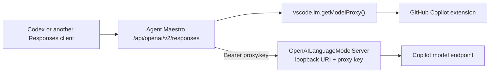

# VS Code OpenAI Language Model Proxy Survey

## Summary

VS Code and the built-in GitHub Copilot extension contain an OpenAI Responses
API proxy intended for external coding agents such as Codex. The supported
consumer shape is the proposed `vscode.lm.getModelProxy()` API, which returns a
loopback URI, a bearer key, and a disposable lease.

This is the preferred future backend for an Agent Maestro
`POST /api/openai/v2/responses` endpoint because it preserves the native
Responses API request and response stream instead of translating through
`LanguageModelChat.sendRequest`.

It is not suitable for a generally published Agent Maestro release yet. The
consumer API remains proposed, and VS Code does not allow ordinary Marketplace
extensions to use proposed APIs in production. Agent Maestro should keep the
current `/api/openai/v1` implementation and revisit `/api/openai/v2` when the
API is finalized or Agent Maestro is explicitly allowed to use the proposal.

## Survey Scope

The findings below were verified on 2026-07-10 against:

- VS Code `main` at `1d6ee9a7e90d16e617bc636af8d047f0f867397d`
  (`package.json` version `1.129.0`).
- VS Code tag `1.120.0`, to confirm that the proposal and Copilot proxy were
  already present in that release.
- Agent Maestro `main` at `2b2fb0ea2cb095335733e8486f6b2f40b930885b`.

This survey distinguishes two similarly named implementations:

1. Copilot extension `OpenAILanguageModelServer`, exposed through the proposed
   extension API. This is the implementation Agent Maestro could consume.
2. VS Code Agent Host `CodexProxyService`, private to VS Code's built-in Codex
   agent. Agent Maestro cannot consume this service directly.

## Copilot `OpenAILanguageModelServer`

### Consumer API

The proposed API is declared in
`src/vscode-dts/vscode.proposed.languageModelProxy.d.ts`:

```typescript
interface LanguageModelProxy extends Disposable {
  readonly uri: Uri;
  readonly key: string;
}

namespace lm {
  const isModelProxyAvailable: boolean;
  const onDidChangeModelProxyAvailability: Event<void>;
  function getModelProxy(): Thenable<LanguageModelProxy>;
}
```

This is the consumer half of the feature. The provider half,
`LanguageModelProxyProvider.provideModelProxy()` and
`vscode.lm.registerLanguageModelProxyProvider()`, is declared separately in
`src/vscode-dts/vscode.proposed.chatParticipantPrivate.d.ts`. GitHub Copilot
uses that private proposal to register the provider; Agent Maestro would need
only the `languageModelProxy` consumer proposal.

`getModelProxy()` asks the registered provider for a proxy dedicated to the
requesting extension. The GitHub Copilot provider creates a new
`OpenAILanguageModelServer`, starts it on a random loopback port, and returns its
URI and generated proxy key. Disposing the returned object stops that server.

The caller therefore does not need to discover a port, access a Copilot token,
or depend on GitHub Copilot's private extension exports.

### Request Flow



The server accepts these equivalent paths:

- `POST /v1/responses`
- `POST /responses`
- `POST //responses`

The last form accommodates clients that append `/responses` to a base URL that
already ends with `/`. It also exposes an unauthenticated `GET /` health
response. Responses requests require `Authorization: Bearer <proxy.key>`.

### Pass-through Behavior

The proxy is materially different from Agent Maestro's current Responses
compatibility route:

- It parses the body only for model selection, telemetry, and a small amount of
  filtering.
- The original Responses request becomes the selected Copilot endpoint's
  request body.
- The endpoint's SSE bytes are written back to the caller while Copilot also
  parses them for its own logging and usage tracking.
- It does not translate the request to `LanguageModelChatMessage[]` and does not
  synthesize Responses events from `LanguageModelChatResponse` parts.
- The inbound user agent is rewritten with the `vscode_codex` prefix, and the
  normal Copilot integration ID header is suppressed for this traffic.

This preserves native Responses features that are difficult or impossible to
reconstruct through the public Language Model API, including native reasoning
items and Copilot's exact Responses event stream.

### Model Selection

The proxy calls `IEndpointProvider.getAllChatEndpoints()` and matches the
request's `model` against `IChatEndpoint.family`, not the VS Code
`LanguageModelChat.id`. When a model is specified, matching is strict equality
with no fuzzy or fallback tier. When no model is specified, the proxy selects
the first available endpoint.

The proxy returns HTTP 404 in two distinct cases:

- No endpoints are available: `No language models available`.
- A model was specified but no endpoint has that family:
  `No model found matching criteria`.

These are upstream model-selection failures and should remain 404 responses
through Agent Maestro. They are distinct from an unavailable Copilot proxy,
which the proposed v2 route should report as 503.

This difference must be verified before an Agent Maestro configurator writes a
model into Codex configuration. A model returned by
`vscode.lm.selectChatModels()` is not automatically guaranteed to have an
identical `id` and Copilot endpoint `family`.

The proxy does not expose a `/models` endpoint. Agent Maestro would still need
to use VS Code model metadata for model selection and confirm the mapping with
integration tests.

### Known Request Limitations

- Tools whose type starts with `web_search` are removed before forwarding.
- Other tool types are forwarded, but the chosen Copilot endpoint remains the
  authority on whether it accepts them.
- The server always writes an SSE response header and processes the upstream
  body with the Responses SSE parser. The intended and known path is a Codex
  streaming request. Non-streaming `stream: false` compatibility needs an
  explicit runtime test before it is documented as supported.
- The server is implemented only in the Node extension host contribution, so a
  web extension host cannot provide it.
- Availability depends on Copilot activation, authentication, account/model
  entitlement, and Codex proxy enablement.

### Availability Gate

The Copilot extension registers its `LanguageModelProxyProvider` only when it
has a Copilot token and either:

- the token enables the Codex agent, or
- the VS Code internal setting `chat.experimental.codex.enabled` is enabled.

Consumers should use `vscode.lm.isModelProxyAvailable` and
`vscode.lm.onDidChangeModelProxyAvailability`; they should not assume that an
installed Copilot extension implies an available proxy.

## Proposed API Status

`languageModelProxy` was introduced in October 2025 and is still listed in
`src/vs/platform/extensions/common/extensionsApiProposals.ts` on the surveyed
July 2026 `main`. It is not part of stable `vscode.d.ts` or the published
`@types/vscode` API.

Every access to `isModelProxyAvailable`,
`onDidChangeModelProxyAvailability`, or `getModelProxy()` is guarded by
`checkProposedApiEnabled(extension, "languageModelProxy")`.

Adding the following manifest field is sufficient only for development:

```json
{
  "enabledApiProposals": ["languageModelProxy"]
}
```

For a non-built-in extension, VS Code removes proposed API access unless the
extension is running in an extension development environment or VS Code was
started with an explicit `--enable-proposed-api <extension-id>` flag. VS Code's
manifest schema also states that extensions declaring proposed APIs cannot be
published normally.

Consequences for Agent Maestro:

| Scenario                                                                       | Status                                                             |
| ------------------------------------------------------------------------------ | ------------------------------------------------------------------ |
| Local Extension Development Host proof of concept                              | Supported                                                          |
| User manually starts VS Code with `--enable-proposed-api Joouis.agent-maestro` | Technically possible, unsuitable as the default product experience |
| Normal Marketplace/Open VSX installation                                       | Blocked                                                            |
| API is finalized into stable `vscode.d.ts`                                     | Preferred release condition                                        |
| Agent Maestro is allowlisted by the VS Code product                            | Possible only with upstream/product coordination                   |

Agent Maestro must not bypass this restriction by probing loopback ports,
reading process arguments, extracting Copilot credentials, or calling private
Copilot extension internals.

## Agent Host `CodexProxyService`

VS Code `main` also contains
`src/vs/platform/agentHost/node/codex/codexProxyService.ts`. It is a separate,
newer implementation used by VS Code's Agent Host Codex provider.

Its behavior is even closer to a raw CAPI proxy:

- It binds a random `127.0.0.1` port and creates a 256-bit nonce.
- It accepts OpenAI Responses requests and forwards the body byte-for-byte to
  `ICopilotApiService.responses()`.
- The Copilot API service discovers the account-specific CAPI host through
  `/copilot_internal/user` and posts to its Responses endpoint with the current
  GitHub bearer token.
- The token can rotate without changing the proxy URI or nonce.
- Models are filtered to those whose CAPI catalog entry advertises
  `/responses` in `supported_endpoints`.

This service is not the Agent Maestro integration point:

- It runs in the separate Agent Host process.
- It starts lazily when VS Code launches its Codex app-server.
- Its random URI and nonce exist only in an internal ref-counted handle.
- The handle is passed directly to the Codex child process through environment
  and in-memory command-line overrides.
- The server shuts down when its last handle is disposed.
- No stable or proposed extension API exposes the handle.

Its code is useful as a reference for cancellation, token rotation, upstream
error handling, and byte-preserving streaming, but Agent Maestro cannot reuse a
running instance.

## Agent Maestro Integration Proposal

### Endpoint Semantics

Keep the existing endpoint unchanged:

```text
POST /api/openai/v1/responses
```

It remains the broadly available compatibility implementation backed by
`LanguageModelChat.sendRequest`.

When the proxy API becomes releasable, add:

```text
POST /api/openai/v2/responses
```

`v2` should mean native Copilot Responses pass-through, not a newer version of
Agent Maestro's request/response conversion layer. Initially, it should expose
only `/responses`; the upstream proxy does not provide Chat Completions or
`/models`.

### Proxy Lease Lifecycle

Introduce an Agent Maestro service responsible for the proposed API boundary:

1. Check `vscode.lm.isModelProxyAvailable`.
2. Lazily call `vscode.lm.getModelProxy()` on the first v2 request.
3. Reuse the returned lease instead of creating one loopback server per HTTP
   request.
4. Dispose the lease when Agent Maestro's proxy server stops or the extension
   deactivates.
5. Observe `onDidChangeModelProxyAvailability`; dispose stale state when the
   provider becomes unavailable and reacquire it on a later request.
6. Deduplicate concurrent acquisition attempts with one shared promise.

The v2 route should return a clear 503 response when Copilot is unavailable,
not authenticated, not entitled, or has not enabled its proxy provider.

### HTTP Forwarding Rules

For each v2 request:

- Forward the request body without parsing or normalizing it.
- Send it to `<proxy.uri>/v1/responses`.
- Replace the inbound authorization header with
  `Authorization: Bearer <proxy.key>`.
- Never expose the proxy key in responses, OpenAPI output, diagnostics, or
  logs.
- Do not forward hop-by-hop headers, the inbound host, or the inbound content
  length.
- Forward only intentional client metadata such as content type, accept, and
  user agent.
- Preserve the upstream status code and content type.
- Stream upstream bytes to the client without decoding and re-encoding SSE.
- Abort the upstream fetch when the external client disconnects.
- Avoid logging request and response bodies until OpenAI-format log
  sanitization is implemented.

Agent Maestro authentication and the inner proxy authentication are separate:
the client authenticates to Agent Maestro with the configured Agent Maestro API
key, while Agent Maestro authenticates to the Copilot loopback server with the
opaque proxy key.

### Security Requirement

The v2 endpoint spends the signed-in user's Copilot quota and provides access to
the same model endpoint used by Codex. It should not be exposed on an
unauthenticated non-loopback listener.

Before release, require at least one of these controls, preferably both:

- bind the Agent Maestro API server to loopback by default;
- require an Agent Maestro API key for `/api/openai/v2/*`.

The inner Copilot proxy key is not a replacement for Agent Maestro
authentication; it must remain private to the extension.

### Codex Configuration

After v2 is available, the Codex provider configuration would use:

```toml
[model_providers.agent-maestro]
name = "Agent Maestro"
base_url = "http://127.0.0.1:23333/api/openai/v2"
wire_api = "responses"
```

The configurator must select a model value accepted by the Copilot endpoint
family lookup. It should not simply assume that every VS Code LM model ID is a
valid native Responses model family.

## Recommended Validation Plan

A development-only proof of concept should verify the following before any
release decision:

1. Proxy availability transitions before and after Copilot authentication.
2. Exact mapping between VS Code model IDs and proxy endpoint families.
3. Codex streaming requests and the full Responses SSE event sequence.
4. Function/custom tool calls and tool outputs across multiple turns.
5. Reasoning items, summaries, and encrypted reasoning content where available.
6. Image inputs supported by the selected endpoint.
7. Client disconnect and cancellation behavior.
8. Copilot quota, billing, and rate-limit errors.
9. Proxy invalidation when Copilot authentication or enablement changes.
10. Behavior of `stream: false`; do not advertise it unless verified.
11. Remote extension-host scenarios, where the returned loopback URI may be on
    the remote extension host rather than the user's local machine.

## Decision

- Continue shipping `/api/openai/v1` through the stable VS Code Language Model
  API.
- Use Copilot's `OpenAILanguageModelServer` through
  `vscode.lm.getModelProxy()` as the intended future `/api/openai/v2` backend.
- Do not use Agent Host `CodexProxyService` directly.
- Do not ship v2 to ordinary users while `languageModelProxy` remains proposed.
- Recheck the proposal whenever Agent Maestro raises its `engines.vscode`
  version or VS Code finalizes/removes the API.
- A development-only proof of concept is reasonable when implementation work is
  prioritized.

## Source Locations

### VS Code API and lifecycle

- `src/vscode-dts/vscode.proposed.languageModelProxy.d.ts`
- `src/vscode-dts/vscode.proposed.chatParticipantPrivate.d.ts`
- `src/vs/workbench/api/common/extHost.api.impl.ts`
- `src/vs/workbench/api/common/extHostLanguageModels.ts`
- `src/vs/platform/extensions/common/extensionsApiProposals.ts`
- `src/vs/workbench/services/extensions/common/extensionsProposedApi.ts`

### GitHub Copilot proxy

- `extensions/copilot/src/extension/externalAgents/vscode-node/lmProxyContrib.ts`
- `extensions/copilot/src/extension/externalAgents/node/modelProxyProvider.ts`
- `extensions/copilot/src/extension/externalAgents/node/oaiLanguageModelServer.ts`

### Agent Host reference implementation

- `src/vs/platform/agentHost/node/codex/codexProxyService.ts`
- `src/vs/platform/agentHost/node/codex/codexAgent.ts`
- `src/vs/platform/agentHost/node/shared/copilotApiService.ts`
- `src/vs/platform/agentHost/node/shared/loopbackProxyServer.ts`

### Agent Maestro current implementation

- `src/server/routes/openai/openaiResponsesRoutes.ts`
- `src/server/routes/openai/openaiRoutes.ts`
- `src/server/ProxyServer.ts`
- `src/commands/configuratorCommands.ts`
- `docs/openai-responses-api-design.md`
